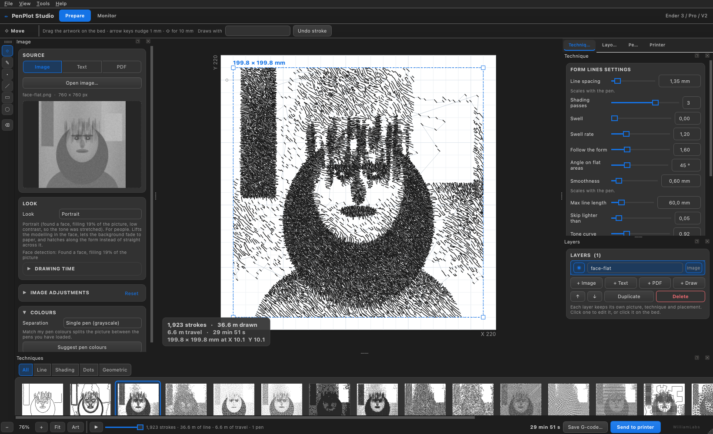
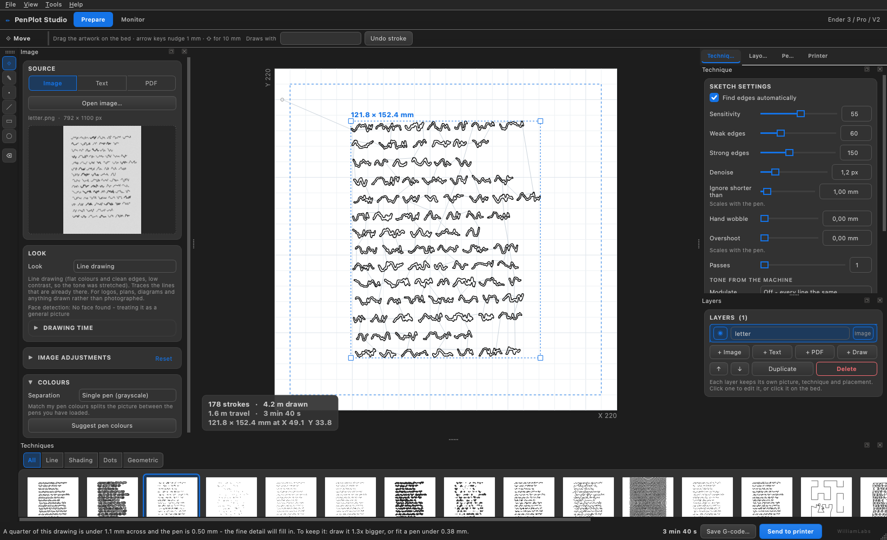
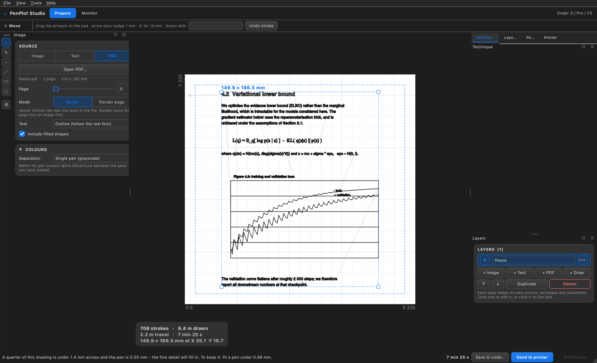
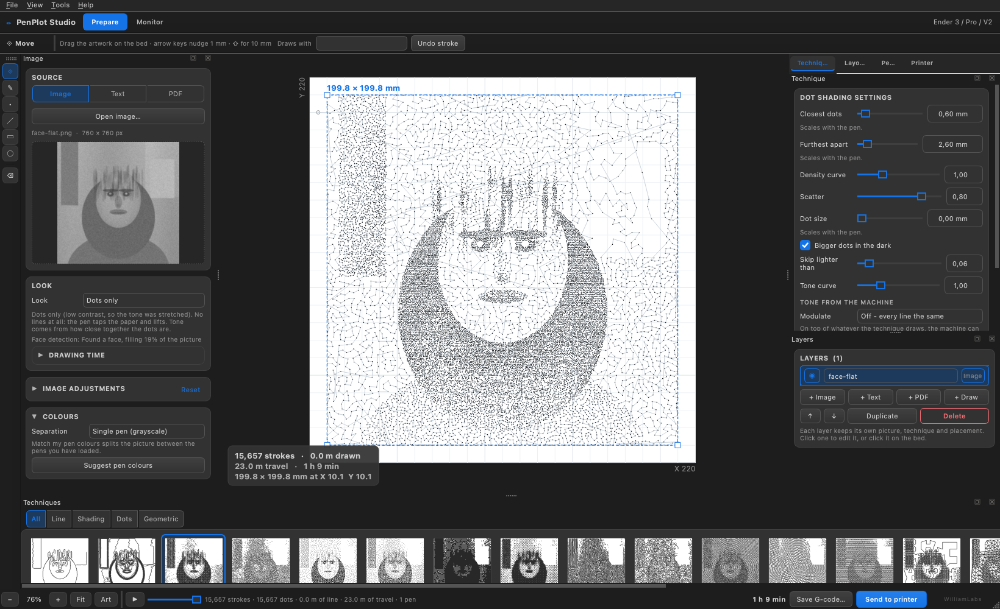

# PenPlot Studio

Turn photographs, drawings and PDFs into pen drawings, and let a 3D printer draw
them. Clamp a pen in the tool holder, connect over USB, and the machine plots.

It also cuts stencils, if you put a blade in the holder instead.



---

## What it does

**Reads the picture and decides.** Drop a photo in and it is ready to plot: the
tonal range is set from the histogram, the approach is chosen from what the
picture actually is, and it says in one line what it did. There is no Render
button — the preview follows every change.

**Knows a face from a bowl of fruit.** With the optional 232 KB detector
enabled, a photograph of a person is *identified* as one and gets the portrait
treatment: local contrast in the face, the background falling back to paper, and
hatching that follows the form. Without the detector it says so and offers the
same look as a suggestion rather than pretending to know.

**Twenty-two drawing techniques** — crosshatch, form lines, flow fields,
stipple, dot shading, Hilbert curves, TSP single-line, Voronoi, mazes and more.
Every one of them scales with the pen you have fitted: a 1.2 mm marker does not
get the same drawing as a 0.2 mm fineliner with tighter lines, it gets a
different drawing, made for that nib.

**Honest numbers.** Length, travel, size and time are measured, not guessed, and
a coarse preview pass is never reported as a finished job.

| | |
|---|---|
|  |  |
| A scanned letter — traces the ink, ignores the paper | A vector PDF — text, equations and figures as real lines |

## Dots, and only dots

The pen touches the paper and lifts. No dragging. The dots crowd together in the
shadows and thin out in the light, and the two spacings are the settings.



## Stencils

Split a picture into N sheets you can spray through, one colour at a time. The
hard part is that a stencil cut wrong falls apart — the middle of an "O" has
nothing holding it. Every island is found in the raster, tied back to the
surround with bridges, and then the sheet is **test-cut in simulation**: the
material is rasterised, the cuts are severed, and if any piece no longer hangs
on, the sheet is rebuilt with wider ties.

## Built for the Ender 3

Pen lifts are 68 % of the moving time on a typical drawing, and the stock
firmware caps the Z axis at 5 mm/s with 100 mm/s² of acceleration — set for a
hot end, not a pen. For the duration of the job the app raises both and puts
them back afterwards, which measured **25 % off the plotting time**.

It knows the difference between firmwares, too: `M203 Z15` means fifteen
millimetres per *second* on Marlin and fifteen per *minute* on RepRapFirmware,
Klipper has no `M203` at all, and GRBL has never heard of `M117`. Nineteen
machine profiles, four firmware families.

## Safety

The pen height is set with `G92`, so the file never homes Z into your paper. The
drawing is checked against the bed before anything is sent, the pen-change point
follows the machine profile, and the app tells you when the nib is fatter than
the detail it is being asked to draw — before it spends an hour proving it.

## Install

Download the latest `.dmg` from [Releases](../../releases), open it, and drag
PenPlot Studio to Applications. macOS only for now.

### From source

```bash
git clone https://github.com/333william333/penplot-studio.git
cd penplot-studio
./run.sh
```

The first run sets up a Python environment (a few minutes). After that it starts
in a couple of seconds.

## Running it

1. Clamp a pen so it can float a little — a spring-loaded holder is ideal.
2. Put paper on the bed and tape it down.
3. Lower the pen until it just touches, in the Monitor tab.
4. Drop a picture in, look at the preview, press **Send to printer**.

There is a fuller manual, in Swedish, in [docs/HANDBOK.md](docs/HANDBOK.md).

## Tests

```bash
.venv/bin/python tests/test_core.py
.venv/bin/python tests/test_stream.py
.venv/bin/python tests/test_interaction.py
```

`test_stream.py` runs the USB protocol against six simulated firmware
behaviours over a pty — resends, reboots, line noise, a printer that stops
answering — because a serial bug costs a sheet of paper and an hour.

## Licence

MIT.

---

<sub>Made by WilliamLabs.</sub>
